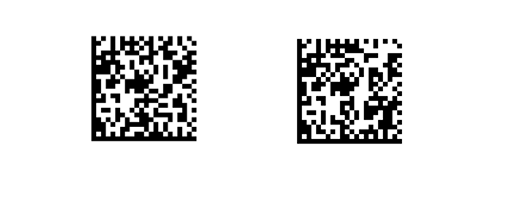

# GS1-Barcode-Reader

A GS1 Barcode Reader Demo.

[Online demo](https://magnificent-pie-f6f946.netlify.app/)

https://github.com/tony-xlh/GS1-Barcode-Reader/assets/5462205/6fb32532-ee40-44f3-9272-013e0fba7767

GS1 barcodes are barcodes whose data conform to the [GS1 specification](https://ref.gs1.org/standards/genspecs/).

Here are some examples:

