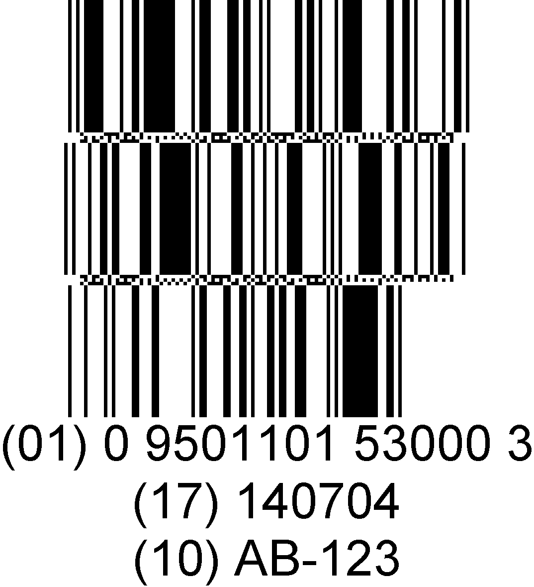

# GS1-Barcode-Reader

A GS1 barcode scanner that runs in the browser. It reads GS1 DataBar, DataBar
Expanded, GS1 DataMatrix, GS1 QR Code, GS1-128, GS1 Composite and ITF-14 with a
camera or from an uploaded image, splits the element string with the application
identifier table, verifies the GTIN check digit, and reports each data element as
a named field.

Powered by [Dynamsoft Barcode Reader](https://www.dynamsoft.com/barcode-reader/overview/)
(v11.6, WebAssembly) for decoding and Dynamsoft Code Parser for the `GS1_AI` spec.

[Online demo](https://www.dynamsoft.com/codepool/demos/gs1-barcode-scanner/)

## GS1 in One Paragraph

GS1 barcodes are barcodes whose data conform to the
[GS1 General Specifications](https://ref.gs1.org/standards/genspecs/). The payload
is a string of concatenated data elements, each beginning with an application
identifier (AI) — two to four digits naming what follows. A data element is
delimited by the end of the string, by its own fixed length, or by FNC1, a
non-printable separator (byte `29`). The structure lives in the AI table, not in
punctuation.




## What It Does

- Reads a symbol from a live camera, an uploaded image, a drag & drop, a
  clipboard paste, or one of the bundled samples.
- Splits the element string by the AI table: fixed-length data by length,
  variable-length data to the next FNC1 or to the end of the string.
- Verifies the mod-10 check digit on GTIN, SSCC and GLN.
- Normalises GS1 dates (`YYMMDD`, day `00` = last day of the month) and the
  `3Ndd` measurement families, whose decimal position the AI itself carries.
- Shows the human readable interpretation, the element string with the FNC1
  positions marked, and the GS1 Digital Link.
- Copies the whole result set as JSON.
- Runs on desktop and mobile browsers.

## Three Things That Are Easy to Get Wrong

**A decoder that strips FNC1 lets a batch number eat the serial.** Given
`…10LOT-4221SN0001` with the separator removed, AI `10` (variable, max 20) reads
to the end of the string and returns `LOT-4221SN0001` — a value that looks
plausible and is wrong. The AI length rules prove it (26 characters read from an
AI that allows 20), and the parser re-splits at the longest head whose remainder
parses cleanly, reporting the repair.

**DataBar, ITF-14 and EAN-13 carry a bare GTIN.** The symbology *is* the
announcement of AI `01`. When the direct parse fails and the payload is nothing
but a 12- to 14-digit number, the GTIN reading is the only one that works.

**GS1 Code Parser is licensed separately.** With a licence that does not cover it,
`parser.parse()` rejects with `[Code Parser] No license found.` The built-in AI
table in `gs1.js` produces the same structure on its own, so the page degrades to
a fully structured result instead of failing.

## Files

| File | What it is |
|---|---|
| `index.html` | The page |
| `gs1.js` | The AI parser: AI table, length rules, check digits, dates, HRI, Digital Link. No DOM, no dependencies |
| `app.js` | SDK wiring, camera control, image input and result rendering |
| `styles.css` | Styling |
| `test-gs1.cjs` | Unit tests for `gs1.js` — 45 assertions, no browser needed |
| `sample-images/` | Two sample GS1 symbols |

## Run Locally

```powershell
python -m http.server 8000
```

Then open `http://localhost:8000/`. The licence in `app.js` is bound to
`dynamsoft.com`, so on any other host the page logs a fallback notice and
activates the SDK's public trial key. That key does not cover Code Parser, so
locally you will see `Built-in AI table — Code Parser unavailable` — the designed
fallback, not a failure.

## Test It

```powershell
node test-gs1.cjs
```

To test the whole chain, generate test images with the
[GS1 generator](https://www.dynamsoft.com/codepool/demos/gs1-barcode-generator/),
scan them here, and compare against the table the generator prints. Every
generator scenario was round-tripped through this scanner with all application
identifiers matching.

## Implementation Notes

- **Configure the reader from a preset**, not from hand-written template JSON. A
  hand-written document is accepted by `initSettings()` and then rejected by
  `startCapturing()` with `[-10038] BarcodeReaderTaskSettingOptions[0]
  .BarcodeFormatIds: The parameter value is invalid or out of range.`
- **The format mask is a `BigInt`.** `BF_ALL` is `18446744069414584319`, past the
  range a JSON number can carry.
- **`capture()` reads barcodes from `items`**; the streaming receiver uses
  `barcodeResultItems`. Both are accepted here.
- **`capture()` detaches the byte buffer it is given**, so a fresh `DSImageData`
  is built per call.
- **The camera uses `startCapturing()`** rather than a manual `fetchImage()` loop,
  which throws `getImageData: Value is not of type 'long'` before the viewfinder
  has produced a frame.

## Blog

[GS1 Barcode Scanner Online – Parse GTIN, Lot, Expiry & Serial](https://www.dynamsoft.com/codepool/scan-and-parse-gs1-barcode.html)

## Licensing

Dynamsoft Barcode Reader and Dynamsoft Code Parser require a licence. Get a
[30-day free trial](https://www.dynamsoft.com/customer/license/trialLicense/?product=dcv&package=cross-platform).
